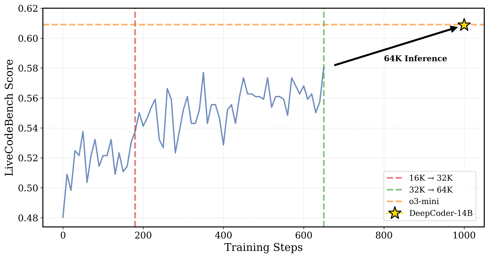
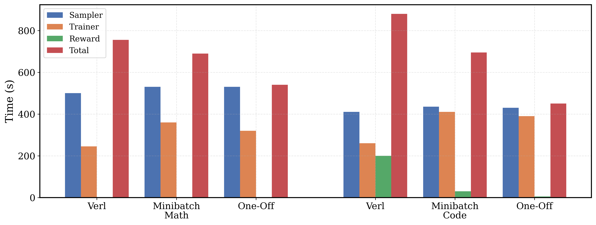

<div align="center">

# rLLM

<div>
🚀 Democratizing Reinforcement Learning (RL) for LLMs 🌟
</div>
</div>
<div>
<br>

<div align="center">

[](https://github.com/agentica-project/rllm)
[](https://www.agentica-project.com) 
[](https://x.com/Agentica_)
[](https://huggingface.co/agentica-org)

</div>

</div>


## Overview

rLLM is an open-source project to fully democratize reinforcement learning (RL) for LLMs and reproduce DeepSeek R1 and OpenAI O1/O3 at scale on real tasks. For all releases, we open source all our efforts here-including training scripts (including hyperparameters), models, systems, dataset, and logs. 

<div align="center">


<sub>*DeepCoder's LiveCodeBench (LCB) score as training progresses. At step 180, context length is extended to 32K. The best 32K checkpoint is used for inference-time scaling to 64K, achieving 60.6% LCB—matching o3-mini's performance. For more details, see our [blog post](https://pretty-radio-b75.notion.site/DeepCoder-A-Fully-Open-Source-14B-Coder-at-O3-mini-Level-1cf81902c14680b3bee5eb349a512a51).*</sub>
</div>

## Releases  📰

<strong>[2025/04/08]</strong> We release `DeepCoder-14B-Preview`, a 14B coding model that achieves an impressive **60.6%** Pass@1 accuracy on LiveCodeBench (+8% improvement), matching the performance of `o3-mini-2025-01-031 (Low)` and `o1-2024-12-17`. As part of this release, we open-source:
- ⬆️ An In-Depth Blog Post on our [Training Recipe and Insights](https://pretty-radio-b75.notion.site/DeepCoder-A-Fully-Open-Source-14B-Coder-at-O3-mini-Level-1cf81902c14680b3bee5eb349a512a51)
- 🤗 HF Model [`DeepCoder-14B-Preview`](https://huggingface.co/agentica-org/DeepCoder-14B-Preview), [`DeepCoder-1.5B-Preview`](https://huggingface.co/agentica-org/DeepCoder-1.5B-Preview)
- 🤗 HF Dataset [`DeepCoder-Preview-Dataset`](https://huggingface.co/datasets/agentica-org/DeepCoder-Preview-Dataset)
- 📄 [Training Scripts](https://github.com/agentica-project/rllm/tree/main/scripts/deepcoder/train)—Exact hyperparameters we used to achieve `o3-mini` performance.
- 📈 [Wandb Training Logs](https://wandb.ai/mluo/deepcoder)—All training runs and ablations.
- 🔎 [Evaluation Logs](https://drive.google.com/file/d/1tr_xXvCJnjU0tLO7DNtFL85GIr3aGYln/view?usp=sharing)—LiveCodeBench and Codeforces logs for DeepCoder.

<strong>[2025/02/10]</strong> We release `DeepScaleR-1.5B-Preview`, a 1.5B model that surpasses O1-Preview and achieves <strong>43.1% Pass@1</strong> on AIME. We achieve this by iteratively scaling Deepseek's GRPO algorithm from 8K→16K->24K context length for thinking. As part of this release, we open-source:

- 🍗 An In-Depth Blog Post on our [Training Recipe and Insights](https://pretty-radio-b75.notion.site/DeepScaleR-Surpassing-O1-Preview-with-a-1-5B-Model-by-Scaling-RL-19681902c1468005bed8ca303013a4e2)
- 🤗 HF Model [`DeepScaleR-1.5B-Preview`](https://huggingface.co/agentica-org/DeepScaleR-1.5B-Preview)
- 🤗 HF Dataset [`DeepScaleR-Preview-Dataset`](https://huggingface.co/datasets/agentica-org/DeepScaleR-Preview-Dataset) / 🗂️  [JSON Dataset](https://github.com/agentica-project/deepscaler/tree/main/deepscaler/data)
- 📄 [Training Scripts](https://github.com/agentica-project/deepscaler/tree/main/scripts/train)—Exact hyperparameters we used to achieve 43.1% on AIME.
- 📈 [Wandb Training Logs](https://wandb.ai/mluo/deepscaler-1.5b)—All training runs and ablations.
  - Due to Wandb migration bugs, the 8k training run is compressed to 400-500 steps. The data is identical, but our original run was 1600 steps.
- 🔎 [Evaluation Logs](https://drive.google.com/file/d/1V_rYKoL35WmubbmWN6PeFg4zo5QOug8X/view?pli=1)—DeepScaleR, Deepseek Distill, and Still 1.5B generations over 1000+ math problems.


## Getting Started 🎯
### Installation
```bash
# Installing Python 3.10 Environment.
conda create -n rllm python=3.10 -y
conda activate rllm

# Installing RLLM dependencies.
cd rllm
pip install -e ./verl
pip install -e .
```

### Data
Our raw training data is in `rllm/data/[train|test]/[code|math]/`, along with preprocessing scripts in `rllm/data/preprocess`. To convert the raw data into Parquet files for training, run:

```bash
# Download datasets from GDrive, populates rllm/data/[train|test]/[math|code]/*.json
python scripts/data/download_datasets.py

# Generate parquet files for Deepcoder/DeepscaleR in data/*.parquet
python scripts/data/[deepcoder|deepscaler]_dataset.py
```

### Training Scripts

We provide training scripts for both DeepCoder and DeepScaleR models in the `scripts/[deepcoder|deepscaler]/train/`. To fully reproduce our DeepCoder and DeepScaleR results, please refer to the corresponding `README.md` files in each directory.

#### Single-Node Training
```bash
export MODEL_PATH="deepseek-ai/DeepSeek-R1-Distill-Qwen-1.5B"
./scripts/[deepscaler|deepcoder]/train/[file].sh --model $MODEL_PATH
```

#### Multi-Node Training

For experiments that require multiple nodes, 

1. On the head node:
```bash
# Set XFormers backend to avoid CUDA errors
export VLLM_ATTENTION_BACKEND=XFORMERS
# Start Ray head node
ray start --head
```

2. On each worker node:
```bash
# Set XFormers backend to avoid CUDA errors
export VLLM_ATTENTION_BACKEND=XFORMERS
# Connect to head node (replace with your head node's address)
ray start --address=[RAY_ADDRESS]
```

3. Finally, on the head node, run the training script:
```bash
# Run 16K or 24K context length training
./scripts/[deepscaler|deepcoder]/train/[file].sh --model [CHECKPOINT_PATH]
```
We welcome the community to try out different models, context lengths, and RL parameters in our provided training scripts!

## Evaluation ⚖️

Our evaluation scripts automatically runs many replicas of vLLM. To run our evaluation scripts, run:
```bash
./scripts/eval/eval_model.sh --model [CHECKPOINT_PATH] --datasets [DATASET1] [DATASET2] --output-dir [OUTPUT_DIR] --n [N_PASSES] --tp [TENSOR_PARALLEL_SIZE] --max-length [MAX_CONTEXT_LENGTH]
```

To replicate our Deepcoder/Deepscaler evaluation, see `scripts/eval/README.md`.

## Results ✅

### DeepCoder

We evaluate `Deepcoder-14B-Preview` on LiveCodeBench (LCB), Codeforces, and HumanEval+, and AIME2024. Notably,`DeepCoder-14B-Preview` AIME score improves without training on math data!

| **Model** | LCB (8/1/24-2/1/25) | Codeforces Rating | Codeforces Percentile | HumanEval+ Pass@1 | AIME 2024 |
| --- | --- | --- | --- | --- | --- |
| **DeepCoder-14B-Preview (ours)** | ***60.6*** | ***1936*** | ***95.3*** | ***92.6*** | ***73.8*** |
| **DeepSeek-R1-Distill-Qwen-14B** | 53.0 | 1791 | 92.7 | 92.0 | 69.7 |
| **O1-2024-12-17 (Low)** | 59.5 | **1991** | **96.1** | 90.8 | **74.4** |
| **O3-Mini-2025-1-31 (Low)** | **60.9** | 1918 | 94.9 | 92.6 | 60.0 |
| **O1-Preview** | 42.7 | 1658 | 88.5 | 89 | 40.0 |
| **Deepseek-R1** | 62.8 | 1948 | 95.4 | 92.6 | 79.8 |
| **Llama-4-Behemoth** | 49.4 | - | - | - | - |
| **DeepCoder-1.5B-Preview** | 25.1 | 963 | 28.5 | 73.0 | - |
| **Deepseek-R1-Distill-Qwen-1.5B** | 16.9 | 615 | 1.9 | 58.3 | 28.8 |

### DeepScaler

We report Pass@1 accuracy averaged over 16 samples for each problem. Notably, our `DeepScaleR-1.5B-Preview` surpasses many open-source 7B models!

| Model | AIME 2024 | MATH 500 | AMC 2023 | Minerva Math | OlympiadBench | Avg. |
|-------|-----------|-----------|-----------|--------------|---------------|------|
| Qwen2.5-Math-7B-Instruct | 13.3 | 79.8 | 50.6 | 34.6 | 40.7 | 43.8 |
| rStar-Math-7B | 26.7 | 78.4 | 47.5 | - | 47.1 | - |
| Eurus-2-7B-PRIME | 26.7 | 79.2 | 57.8 | 38.6 | 42.1 | 48.9 |
| Qwen2.5-7B-SimpleRL | 26.7 | 82.4 | 62.5 | <strong>39.7</strong> | 43.3 | 50.9 |
| DeepSeek-R1-Distill-Qwen-1.5B | 28.8 | 82.8 | 62.9 | 26.5 | 43.3 | 48.9 |
| Still-1.5B | 32.5 | 84.4 | 66.7 | 29.0 | 45.4 | 51.6 |
| <strong>DeepScaleR-1.5B-Preview</strong> | <strong>43.1</strong> | <strong>87.8</strong> | <strong>73.6</strong> | 30.2 | <strong>50.0</strong> | <strong>57.0</strong> |
| O1-Preview | 40.0 | 81.4 | - | - | - | - |

We also show the validation curve during training:


<div align="center">
  

  <sub>*DeepScaleR 1.5B model's Pass@1 accuracy on AIME2024 as RL training progresses. At step 1040 and 1520, the context length is extended to 16K and 24K. For more details, see our [blog post](https://pretty-radio-b75.notion.site/DeepScaleR-Surpassing-O1-Preview-with-a-1-5B-Model-by-Scaling-RL-19681902c1468005bed8ca303013a4e2) .*</sub>
</div>

## System 🤖

<div align="center">
  

  <sub>*Our verl-pipe extension (One-off Pipeline) masks away trainer and reward computation times,reducing training times by 1.4x for math and 2x for coding.*</sub>
</div>

To accelerate post-training, we develop `verl-pipe`, an asynchronous pipelined version of verl, that reduces end2end training times by up to **2x**. Such changes are implemented in`agentica-project/verl-pipeline`. See our [blog post](https://pretty-radio-b75.notion.site/DeepCoder-A-Fully-Open-Source-14B-Coder-at-O3-mini-Level-1cf81902c14680b3bee5eb349a512a51) for more details.

We've trained `DeepCoder-1.5B-Preview`, not `DeepCodeR-14B-Preview`, with `verl-pipe`, increasing LiveCodeBench scores from 17->25%.

To install `verl-pipeline`, run:
```bash
git clone https://github.com/agentica-project/verl-pipeline.git
cd verl-pipeline
pip install -e .
```

Example scripts to run pipelined post-training are located in `scripts/pipeline`. We note our `verl-pipeline` is 1-2 weeks behind verl main.

## Acknowledgements

- Our training experiments are powered by our heavily modified fork of [verl](https://github.com/volcengine/verl), an open-source RLHF library.
- Our model is trained on top of [`DeepSeek-R1-Distill-Qwen-1.5B`](https://huggingface.co/deepseek-ai/DeepSeek-R1-Distill-Qwen-1.5B) and [`DeepSeek-R1-Distill-Qwen-14B`](https://huggingface.co/deepseek-ai/DeepSeek-R1-Distill-Qwen-14B).
- Our work is done as part of  [Berkeley Sky Computing Lab](https://skycomputing.berkeley.edu/), [Berkeley AI Research](https://bair.berkeley.edu/), and a successful collaboration with Together AI.


## Citation


```bibtex
@misc{deepcoder2025,
  title={DeepCoder: A Fully Open-Source 14B Coder at O3-mini Level},
  author={Michael Luo, Sijun Tan, Roy Huang, Xiaoxiang Shi, Rachel Xin, Colin Cai, Ameen Patel, Alpay Ariyak, Qingyang Wu, Ce Zhang, Li Erran Li, Raluca Ada Popa, Ion Stoica},
  howpublished={\url{https://pretty-radio-b75.notion.site/DeepCoder-A-Fully-Open-Source-14B-Coder-at-O3-mini-Level-1cf81902c14680b3bee5eb349a512a51}},
  note={Notion Blog},
  year={2025}
}
```

```bibtex
@misc{deepscaler2025,
  title={DeepScaleR: Surpassing O1-Preview with a 1.5B Model by Scaling RL},
  author={Michael Luo and Sijun Tan and Justin Wong and Xiaoxiang Shi and William Y. Tang and Manan Roongta and Colin Cai and Jeffrey Luo and Li Erran Li and Raluca Ada Popa and Ion Stoica},
  year={2025},
  howpublished={\url{https://pretty-radio-b75.notion.site/DeepScaleR-Surpassing-O1-Preview-with-a-1-5B-Model-by-Scaling-RL-19681902c1468005bed8ca303013a4e2}},
  note={Notion Blog}
  year={2025}
}
```
